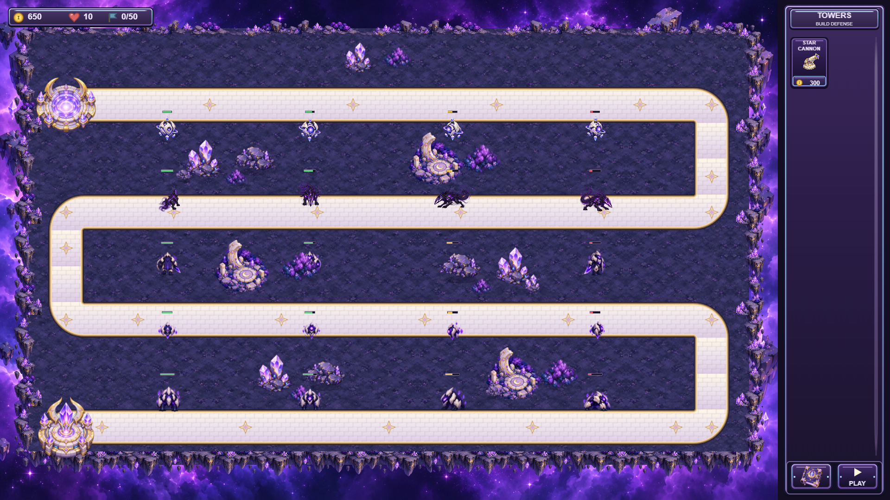

# HP Bars & Gameplay Balance - Celestial Void

Tanggal:2026-10-09. Implementasi langsung pada folder project existing. Scene tetap `Game Scene`;59 object definitions,324 resources, lima enemy dan satu tower resmi. Tidak ada artwork, directional animation, map, road/waypoint, camera, selection/placement UI, collision mask, muzzle, atau sell behavior yang diganti.

## A. HP bar fixes

**Root cause hilangnya bar sudah direproduksi dalam runtime native.** Bar Hound/common enemy dihapus pada logical death, tetapi destroy callback masih terpasang pada corpse yang bertahan0.65/0.75s. Bar native yang dihapus dipakai ulang oleh enemy baru. Ketika corpse lama benar-benar dihapus, callback lamanya menghapus bar milik enemy baru. Map cache masih menyimpan pasangan tersebut, sehingga bar tidak dibuat ulang. Sebelum perbaikan:bar reused=true, living enemy=true, map owner=true, background/fill in scene=false. Sesudah perbaikan:semuanya true.

Fix:unregister callback pada logical death; cleanup idempotent; pasangan menyimpan ID lifetime enemy, background, dan fill. Hanya object dengan UID dan OwnerEnemyId yang sesuai yang boleh dihapus. Object bar yang hilang/dipakai ulang di luar sistem dideteksi dan pasangan diperbaiki. Semua kematian, base leaks, external deletion, dan scene cleanup menghapus kepemilikannya. Tidak ada pencarian nearest-enemy atau state HP global.

Root cause ukuran/posisi:width lama berasal dari collider48 dikali skala render1.55/1.8/2.1, menghasilkan67/78/91px; offset Hound dihitung seperti visual74px padahal render Hound96px. Ukuran baru fixed world pixels dan offset head konsisten per tipe, tidak berasal dari MaxHP, atlas dimensions, atau arah.

| Enemy | Width lama | Width baru | Height baru | Head offset |
|---|---:|---:|---:|---:|
| Nova Wisp | 67 | 24 | 6 | 40 |
| Void Hound | 67 | 30 | 6 | 60 |
| Void Guard | 78 | 30 | 6 | 48 |
| Void Sentinel | 67 | 26 | 6 | 42 |
| Void Brute | 91 | 36 | 6 | 55 |

Track gelap dengan border violet tipis; fill hijau>60%, kuning30-60%, merah<30%. Inner fill `(Width-2)*clamp(CurrentHP/MaxHP,0,1)`; margin/border1px setiap sisi. Posisi mengikuti center/layer enemy; Z20000/20001 di World layer di atas sprite/props/effects, tetap di bawah layer UI. Dibuat sekali per spawn; update ukuran/fill/color hanya bila berubah.

Bukti: `before-healthbars.json`, `after-healthbars.json`,183 native HP/balance checks,200-owner allocation/cleanup checks, dan `HP_Bars_Five_Enemies.png` pada folder hasil. Screenshot terakhir merupakan fixture20 views dengan HP100/75/50/25%, bukan perubahan stats enemy di project.

## B. Tower balance and damage audit

Star Cannon base dipertahankan:Damage50, interval0.9s, range210, projectile speed520, satu shot. Tidak ada critical damage. Target terdekat/valid lock, rotasi240deg/s, toleransi8deg, homing, transformed muzzle, footprint, projectile/effect artwork, dan21 state visual tetap.

Damage audit:primary terkena direct sekali dan dikecualikan dari splash-nya sendiri. Setiap projectile punya hit guard dan dihapus setelah impact. Projectile kedua/ketiga adalah damage yang memang diizinkan oleh volley, bukan collision ganda. Jika primary sudah mati, projectile tersisa tidak merusak corpse. DamageDealt mencatat HP aktual yang hilang, dibatasi oleh sisa HP; rewards hanya sekali. Tidak ditemukan critical/duplicate collision/splash bug yang menjelaskan tower terlalu kuat.

Masalah dominan:unlimited density splash65%/radius98, multipliers damage yang berantai, dan investasi max yang murah; spacing spawn0.9s tetap membuat tower tunggal bisa membersihkan antrian. Stat tier baru berupa tabel cumulative sehingga tidak bergantung pada urutan upgrade atau menumpuk ulang modifier.

| Path1 level | Damage sebelum | Damage sesudah | Effect sebelum | Effect sesudah |
|---|---:|---:|---|---|
| 0 | 50 | 50 | None | None |
| 1 | 57.5 | 56 | +15% | +12% total |
| 2 | 66.125 | 62 | range +5% | damage +24% total, range +4% |
| 3 | 66.125 | 62 | splash40%, radius70 | splash25%, radius64 |
| 4 | 89.26875 | 74 | splash65%, radius98 | splash40%, radius84 |

| Path2 level | Interval sebelum | Interval sesudah | Shots/damage sebelum | Shots/damage sesudah |
|---|---:|---:|---|---|
| 0 | 0.9 | 0.9 | 1 x100% | 1 x100% |
| 1 | 0.7826 | 0.8182 | 1 x100% | 1 x100% |
| 2 | 0.7115 | 0.7377 | 1 x100%, range+5% | 1 x100%, range+4% |
| 3 | 0.7115 | 0.7377 | 2 x65% | 2 x62% |
| 4 | 0.7115 | 0.7377 | 3 x60% | 3 x56% |

Crosspath2+ range berubah231.525 ->227.136. Path1 tetap crowd/armor dengan raw hit besar dan splash; Path2 tetap burst untuk fast/unarmored enemies. Abilities muncul hanya mulai level3. Valid builds tetap21;4-2/2-4 valid,3-3/4-3/4-4 ditolak tanpa charging Gold.

**DPS/cost efficiency seluruh build.** DPS berikut adalah upper-bound theoretical single-target `PerShot*Shots/Interval` sebelum armor, turning, homing travel, target downtime dan overkill. Splash ditambahkan per tetangga dalam radius, tidak dihitung sebagai multiplier DPS permanen. Kolom terakhir adalah DPS baru per1000Gold dari total build cost. Hasil combat native di bagianF.

| Build | Cost sebelum | Cost baru | DPS sebelum | DPS baru | Range baru | DPS/1000Gold baru |
|---|---:|---:|---:|---:|---:|---:|
| 0-0 | 300 | 300 | 55.5556 | 55.5556 | 210 | 185.1852 |
| 0-1 | 400 | 430 | 63.8889 | 61.1111 | 210 | 142.1189 |
| 0-2 | 575 | 710 | 70.2778 | 67.7778 | 218.4 | 95.4617 |
| 0-3 | 1175 | 1710 | 91.3611 | 84.0444 | 218.4 | 49.1488 |
| 0-4 | 2275 | 4210 | 126.5 | 113.8667 | 218.4 | 27.0467 |
| 1-0 | 425 | 460 | 63.8889 | 62.2222 | 210 | 135.2657 |
| 1-1 | 525 | 590 | 73.4722 | 68.4444 | 210 | 116.0075 |
| 1-2 | 700 | 870 | 80.8194 | 75.9111 | 218.4 | 87.2542 |
| 1-3 | 1300 | 1870 | 105.0653 | 94.1298 | 218.4 | 50.3368 |
| 1-4 | 2400 | 4370 | 145.475 | 127.5307 | 218.4 | 29.1832 |
| 2-0 | 625 | 760 | 73.4722 | 68.8889 | 218.4 | 90.6433 |
| 2-1 | 725 | 890 | 84.4931 | 75.7778 | 218.4 | 85.1436 |
| 2-2 | 900 | 1170 | 92.9424 | 84.0444 | 227.136 | 71.8329 |
| 2-3 | 1500 | 2170 | 120.8251 | 104.2151 | 227.136 | 48.0254 |
| 2-4 | 2600 | 4670 | 167.2962 | 141.1947 | 227.136 | 30.2344 |
| 3-0 | 1275 | 1860 | 73.4722 | 68.8889 | 218.4 | 37.037 |
| 3-1 | 1375 | 1990 | 84.4931 | 75.7778 | 218.4 | 38.0793 |
| 3-2 | 1550 | 2270 | 92.9424 | 84.0444 | 227.136 | 37.024 |
| 4-0 | 2525 | 4660 | 99.1875 | 82.2222 | 218.4 | 17.6443 |
| 4-1 | 2625 | 4790 | 114.0656 | 90.4444 | 218.4 | 18.8819 |
| 4-2 | 2800 | 5070 | 125.4722 | 100.3111 | 227.136 | 19.7852 |

Full per-projectile damage, effective DPS terhadap setiap armor, marginal DPS/cost, range gain, splash DPS per neighbour, dan total costs tersimpan di `balance-analysis.json`. Basic tower paling efisien untuk membeli coverage baru. Upgrade membeli kemampuan menangani crowd, pengurangan jumlah hit pada armor, dan burst dari satu lokasi; tidak lagi selalu lebih baik daripada membangun tower tambahan.

## C. Upgrade economy

| Purchase/upgrade | Sebelum | Sesudah |
|---|---:|---:|
| Star Cannon purchase | 300 | 300 |
| Star Destroyer Lv1: REINFORCED CORE | 125 | 160 |
| Star Destroyer Lv2: HEAVY IMPACT | 200 | 300 |
| Star Destroyer Lv3: STAR EXPLOSION | 650 | 1100 |
| Star Destroyer Lv4: SUPERNOVA | 1250 | 2800 |
| Cosmic Barrage Lv1: RAPID FIRE | 100 | 130 |
| Cosmic Barrage Lv2: PRECISION CORE | 175 | 280 |
| Cosmic Barrage Lv3: TWIN STAR | 600 | 1000 |
| Cosmic Barrage Lv4: METEOR BARRAGE | 1100 | 2500 |
| Total4-2 | 2800 | 5070 |
| Total2-4 | 2600 | 4670 |

Level1 tetap dapat dibeli pada awal game; level2 bersaing langsung dengan pembelian tower300. Level3 bernilai1000/1100 dan level4 bernilai2500/2800, sesuai lonjakan kemampuan/crowd yang ditunjukkan model. Harga bukan satu multiplier seragam. Dengan semua kill dan tanpa belanja lain,4-2 paling awal setelahWave17 dan2-4 setelahWave16 (sebelumnya keduanya setelahWave10). Ini batas optimistik, bukan saran menyimpan semua Gold pada satu tower.

Starting650, tower300, sell70% total investment, clear obstacle250, enemy kill rewards tetap. Tidak ada passive income. Completion100 ->60, satu kali per wave; banner memakai nilai konfigurasi yang sama. Discount income bukan satu-satunya perubahan:upgrade costs, damage tiers, density/pacing, dan tank composition ditangani bersama.

| Setelah wave | Total Gold sebelum | Total Gold sesudah |
|---|---:|---:|
| 5 | 1468 | 1268 |
| 10 | 2920 | 2558 |
| 15 | 5015 | 4534 |
| 20 | 7759 | 7202 |

Gold di atas termasuk650 awal, dengan semua kill, sebelum belanja. Sisa Gold campaign berbeda karena investasi. Refund dipertahankan dan native tests memeriksa charging/refund sekali.

## D. Enemy stats and armor

Nilai actual di JSON diperiksa sebelum perubahan; sama dengan referensi user. Tidak ada kebutuhan menaikkan HP/speed secara acak:benchmark sesudah perbaikan tower/composition sudah memenuhi target. Semua identitas/stat individual dipertahankan.

| Enemy | HP sebelum -> sesudah | Speed | Armor | Gold |
|---|---|---:|---:|---:|
| Nova Wisp | 100 ->100 | 80 ->80 | 0 ->0 | 5 ->5 |
| Void Hound | 60 ->60 | 135 ->135 | 0 ->0 | 7 ->7 |
| Void Guard | 150 ->150 | 70 ->70 | 10 ->10 | 8 ->8 |
| Void Sentinel | 120 ->120 | 85 ->85 | 0 ->0 | 6 ->6 |
| Void Brute | 220 ->220 | 60 ->60 | 15 ->15 | 10 ->10 |

Armor tetap **native flat reduction**, percent reduction0. Sebelum:`max(0,raw-flatArmor)` dapat menjadi0 pada splash kecil. Sesudah:`max(1,raw-flatArmor)` untuk impact positif; zero/negative/NaN tidak menciptakan hit. Ini dilakukan melalui Health.Hit yang sudah ada dengan input `max(raw,flatArmor+1)`, tanpa mengganti Health extension. Armor aktual diambil dari behavior yang juga di-set oleh spawner, bukan variabel global. Guard50hit->40; Brute50hit->35 tetap. Minimum1 terutama membantu splash kecil; tidak menghapus identitas armored enemy.

## E. Wave progression

50 waves, `TotalEnemies=wave*4`,5100 total. Tidak ada wave HP/speed/armor/reward scaling dan tidak ada enemy/boss/ability baru. Enemy order mempertahankan semua Hound slots; added types di-interleave pada slot Nova.

| Type | Introduksi | Count before | Count after |
|---|---:|---:|
| Hound | Wave4 | +4 setiap3waves | sama |
| Sentinel | Wave5 | +2 setiap3waves | sama |
| Guard | Wave6 | +2 setiap4waves | +3 setiap4waves |
| Brute | Wave7 | +1 setiap5waves | +2 setiap5waves |

Interval game-seconds `max(0.36,0.9-max(0,wave-5)*0.015)`. Waves1-5 tetap0.9. Pengurangan0.015 per wave menyebarkan tekanan tanpa lonjakan kecepatan enemy. Late pacing menuntut throughput beberapa tower. Auto intermission3s, Manual/Auto1x/2x tidak diubah.

| Wave | Nova | Hound | Sentinel | Guard | Brute | Total | Interval |
|---|---:|---:|---:|---:|---:|---:|---:|
| 1 | 4 | 0 | 0 | 0 | 0 | 4 | 0.9 |
| 4 | 12 | 4 | 0 | 0 | 0 | 16 | 0.9 |
| 5 | 14 | 4 | 2 | 0 | 0 | 20 | 0.9 |
| 6 | 15 | 4 | 2 | 3 | 0 | 24 | 0.885 |
| 7 | 13 | 8 | 2 | 3 | 2 | 28 | 0.87 |
| 10 | 16 | 12 | 4 | 6 | 2 | 40 | 0.825 |
| 15 | 23 | 16 | 8 | 9 | 4 | 60 | 0.75 |
| 20 | 26 | 24 | 12 | 12 | 6 | 80 | 0.675 |
| 35 | 38 | 44 | 22 | 24 | 12 | 140 | 0.45 |
| 50 | 50 | 64 | 32 | 36 | 18 | 200 | 0.36 |

## F. Simulation and executed native gameplay results

**Numerical model:**dependency-free Node.js, actual82-point route/7128world-units, component muzzle geometry, homing520, nearest target retention,240deg/s turning,8deg fire tolerance, fixed archetype stats, armor, per-projectile overkill, splash neighbours, and50ms steps. It is an estimate, not the native engine. All21 builds and50-wave economy calculated. Difficulty scenarios sampledW1/5/10/15/20/35/50; both max builds also swept across22 valid placement points atWave50. None of44 max-tower position trials cleared200/200 after changes. Before model4-2 at(800,352) cleared200/200; after predicted114/200. Actual native result102/200 below.

**Native combat:**exported project compiled through installed GDevelop5.6.283, actual events/Health/projectiles/movement. No combat function replaced. Standalone wave diagnostics grant100000Gold/10000Lives solely to build fixtures and count every leak; a default10-Life game fails long before98/128 leaks. They are not affordable early-game campaigns. Native data from executed console records is preserved in `native-standalone-scenarios.json`.

| Scenario | Wave | Investment | Native kills | Leaks | Outcome |
|---|---:|---:|---:|---:|---|
| base | 20 | 300 | 21/80 | 59 | Insufficient |
| max42 | 50 | 5070 | 102/200 | 98 | Insufficient |
| max24 | 50 | 4670 | 72/200 | 128 | Insufficient |
| sixBasic | 20 | 1800 | 80/80 | 0 | Clear |
| sixBasic | 50 | 1800 | 181/200 | 19 | Insufficient |
| mixed | 20 | 6980 | 80/80 | 0 | Clear |
| mixed | 50 | 6980 | 200/200 | 0 | Clear |

Positions for six-basic/mixed:(300,352),(800,352),(1300,352),(400,616),(900,616),(1400,616). All checked by native placement validator. Mixed builds2-0,3-2,2-3,1-1,2-1,0-0 cost6980; no fully max tower needed for the diagnostic late clear. Six basic cost1800:strong coverage throughWave20, but insufficient forWave50.

**Early/native economy:**one purchased base tower at(800,352) clearsW1-4. Native Wave5 needs support after Sentinel introduction; model had optimistically estimated one-tower clearance. Second tower at(300,352) is bought from earned Gold beforeW5. AllW1-5 cleared,10Lives retained,600spent/668Gold remaining. This adapts to enemy composition without requiring a max tower.

**Earned-income native campaign:**starting650Gold/10Lives; two basic initially, additions beforeW5/9/13/17 and moderate upgrades chosen between waves. ActualGold checks prevent overspending; no injected reward or life refill. AllW1-20 cleared with10Lives. AtW20,6 towers2-0/3-2/2-2/1-1/2-1/0-0 cost5980;1222Gold remains, enough to buy the next Cosmic path3 beforeW21.

| Campaign checkpoint | Towers/builds | Investment | Remaining Gold | Lives |
|---|---|---:|---:|---:|
| W5 | 0-0, 0-0, 0-0 | 900 | 368 | 10 |
| W10 | 2-0, 1-0, 0-1, 0-0 | 1950 | 608 | 10 |
| W15 | 2-0, 2-2, 2-2, 1-0, 0-0 | 3860 | 674 | 10 |
| W20 | 2-0, 3-2, 2-2, 1-1, 2-1, 0-0 | 5980 | 1222 | 10 |

Raw evidence:`native-campaigns.json` contains all25 native campaign wave results and104 passed checks;console errors0. `live-qa.json` contains27 passed rendered/live checks and20 simultaneous directional views. Regression50-wave suite verifies5100 spawns, all fixed stats/counts/pacing, gold/reward/drain/victory; it kills fixture enemies programmatically and is not a full player playthrough.

## G. Validation, performance, and files

Native parser/scene compiler/Health generator/export executed:59objects,324resources,0 scene diagnostics,export true. Native frame references resolve; project JSON remains valid folder project.

| Executed suite | Passed checks |
|---|---:|
| test-healthbars-balance | 183 |
| test-clean-project | 283 |
| test-void-hound | 117 |
| test-void-common | 636 |
| test-nova-wisp | 10478 |
| Native earned-income campaigns | 104 |
| Native rendered/live QA | 27 |
| Static/hash/reference audit | 1280 |

Static audit checks unchanged scene instances/layers/groups/folders/properties/shared behavior data, all unrelated native conditions/actions, untouched runtime bytes, all enemy/tower art/animations,323 original resources, and344 original asset hashes. Only HP track SVG/frame reference is added. Full static evidence:`static-audit.json`.

Performance changes:target acquisition previously called `getObjects(Enemy).includes` for each candidate, creatingO(T*E^2) membership work; native loop now supplies one Set, making membership O(T*E), retaining nearest/locked targeting. HP state creates pairs only on spawn or repair; update caches and one linear membership pass guard pooled IDs. Existing particle/art systems retained.200 independent bars survive100frames and then delete without leftovers.

| Live stress fixture | Samples | Mean frame ms | Max frame ms |
|---|---:|---:|---:|
| 40 enemies /12 towers | 120 | 6.95 | 15.10 |
| 200 enemies /12 towers | 120 | 6.96 | 24.30 |

Headless device sample, static mixed enemies, forced target reacquisition, firing held by long cooldown. It tests allocation/render/acquisition pressure, not full projectile-heavy gameplay or a universal FPS guarantee. No claim of before/after FPS uplift is made.

**Files changed:**full exact inventory follows. Backup is source/config only (`backups/pre_hp_bars_balance_20261009.zip`); original art is verified unchanged and the pre-task Git state also exists. No additional cleanup or commit performed.

- [BALANCE.md](<C:/Users/My ASUS/OneDrive/Documents/GitHub/GameDevelop/BALANCE.md>)
- [HP_BARS_BALANCE_REPORT.md](<C:/Users/My ASUS/OneDrive/Documents/GitHub/GameDevelop/HP_BARS_BALANCE_REPORT.md>)
- [README.md](<C:/Users/My ASUS/OneDrive/Documents/GitHub/GameDevelop/README.md>)
- [STAR_CANNON.md](<C:/Users/My ASUS/OneDrive/Documents/GitHub/GameDevelop/STAR_CANNON.md>)
- [Tower Defense.json](<C:/Users/My ASUS/OneDrive/Documents/GitHub/GameDevelop/Tower Defense.json>)
- [assets/ui/enemy-health-track.svg](<C:/Users/My ASUS/OneDrive/Documents/GitHub/GameDevelop/assets/ui/enemy-health-track.svg>)
- [backups/pre_hp_bars_balance_20261009.zip](<C:/Users/My ASUS/OneDrive/Documents/GitHub/GameDevelop/backups/pre_hp_bars_balance_20261009.zip>)
- [design_previews/gameplay_balance/After_HP_Bars.png](<C:/Users/My ASUS/OneDrive/Documents/GitHub/GameDevelop/design_previews/gameplay_balance/After_HP_Bars.png>)
- [design_previews/gameplay_balance/Before_HP_Bars.png](<C:/Users/My ASUS/OneDrive/Documents/GitHub/GameDevelop/design_previews/gameplay_balance/Before_HP_Bars.png>)
- [design_previews/gameplay_balance/HP_Bars_Five_Enemies.png](<C:/Users/My ASUS/OneDrive/Documents/GitHub/GameDevelop/design_previews/gameplay_balance/HP_Bars_Five_Enemies.png>)
- [design_previews/gameplay_balance/after-healthbars.json](<C:/Users/My ASUS/OneDrive/Documents/GitHub/GameDevelop/design_previews/gameplay_balance/after-healthbars.json>)
- [design_previews/gameplay_balance/balance-analysis.json](<C:/Users/My ASUS/OneDrive/Documents/GitHub/GameDevelop/design_previews/gameplay_balance/balance-analysis.json>)
- [design_previews/gameplay_balance/before-asset-hashes.json](<C:/Users/My ASUS/OneDrive/Documents/GitHub/GameDevelop/design_previews/gameplay_balance/before-asset-hashes.json>)
- [design_previews/gameplay_balance/before-config.json](<C:/Users/My ASUS/OneDrive/Documents/GitHub/GameDevelop/design_previews/gameplay_balance/before-config.json>)
- [design_previews/gameplay_balance/before-healthbars.json](<C:/Users/My ASUS/OneDrive/Documents/GitHub/GameDevelop/design_previews/gameplay_balance/before-healthbars.json>)
- [design_previews/gameplay_balance/implementation-summary.json](<C:/Users/My ASUS/OneDrive/Documents/GitHub/GameDevelop/design_previews/gameplay_balance/implementation-summary.json>)
- [design_previews/gameplay_balance/live-qa.json](<C:/Users/My ASUS/OneDrive/Documents/GitHub/GameDevelop/design_previews/gameplay_balance/live-qa.json>)
- [design_previews/gameplay_balance/modified-files.txt](<C:/Users/My ASUS/OneDrive/Documents/GitHub/GameDevelop/design_previews/gameplay_balance/modified-files.txt>)
- [design_previews/gameplay_balance/native-campaigns.json](<C:/Users/My ASUS/OneDrive/Documents/GitHub/GameDevelop/design_previews/gameplay_balance/native-campaigns.json>)
- [design_previews/gameplay_balance/native-standalone-scenarios.json](<C:/Users/My ASUS/OneDrive/Documents/GitHub/GameDevelop/design_previews/gameplay_balance/native-standalone-scenarios.json>)
- [design_previews/gameplay_balance/numerical-scenarios.json](<C:/Users/My ASUS/OneDrive/Documents/GitHub/GameDevelop/design_previews/gameplay_balance/numerical-scenarios.json>)
- [design_previews/gameplay_balance/static-audit.json](<C:/Users/My ASUS/OneDrive/Documents/GitHub/GameDevelop/design_previews/gameplay_balance/static-audit.json>)
- [design_previews/gameplay_balance/test-clean-project-results.txt](<C:/Users/My ASUS/OneDrive/Documents/GitHub/GameDevelop/design_previews/gameplay_balance/test-clean-project-results.txt>)
- [design_previews/gameplay_balance/test-healthbars-balance-results.txt](<C:/Users/My ASUS/OneDrive/Documents/GitHub/GameDevelop/design_previews/gameplay_balance/test-healthbars-balance-results.txt>)
- [design_previews/gameplay_balance/test-nova-wisp-results.txt](<C:/Users/My ASUS/OneDrive/Documents/GitHub/GameDevelop/design_previews/gameplay_balance/test-nova-wisp-results.txt>)
- [design_previews/gameplay_balance/test-void-common-results.txt](<C:/Users/My ASUS/OneDrive/Documents/GitHub/GameDevelop/design_previews/gameplay_balance/test-void-common-results.txt>)
- [design_previews/gameplay_balance/test-void-hound-results.txt](<C:/Users/My ASUS/OneDrive/Documents/GitHub/GameDevelop/design_previews/gameplay_balance/test-void-hound-results.txt>)
- [layouts/game-scene.json](<C:/Users/My ASUS/OneDrive/Documents/GitHub/GameDevelop/layouts/game-scene.json>)
- [tools/analyze-game-balance.cjs](<C:/Users/My ASUS/OneDrive/Documents/GitHub/GameDevelop/tools/analyze-game-balance.cjs>)
- [tools/apply-game-balance.py](<C:/Users/My ASUS/OneDrive/Documents/GitHub/GameDevelop/tools/apply-game-balance.py>)
- [tools/audit-hp-balance.py](<C:/Users/My ASUS/OneDrive/Documents/GitHub/GameDevelop/tools/audit-hp-balance.py>)
- [tools/balance-browser.py](<C:/Users/My ASUS/OneDrive/Documents/GitHub/GameDevelop/tools/balance-browser.py>)
- [tools/enemy-healthbar-runtime.js](<C:/Users/My ASUS/OneDrive/Documents/GitHub/GameDevelop/tools/enemy-healthbar-runtime.js>)
- [tools/live-hp-balance-qa.js](<C:/Users/My ASUS/OneDrive/Documents/GitHub/GameDevelop/tools/live-hp-balance-qa.js>)
- [tools/native-balance-scenarios.js](<C:/Users/My ASUS/OneDrive/Documents/GitHub/GameDevelop/tools/native-balance-scenarios.js>)
- [tools/nova-wave-manager.js](<C:/Users/My ASUS/OneDrive/Documents/GitHub/GameDevelop/tools/nova-wave-manager.js>)
- [tools/probe-healthbars.js](<C:/Users/My ASUS/OneDrive/Documents/GitHub/GameDevelop/tools/probe-healthbars.js>)
- [tools/report-game-balance.py](<C:/Users/My ASUS/OneDrive/Documents/GitHub/GameDevelop/tools/report-game-balance.py>)
- [tools/run-clean-validation.py](<C:/Users/My ASUS/OneDrive/Documents/GitHub/GameDevelop/tools/run-clean-validation.py>)
- [tools/star-cannon-runtime.js](<C:/Users/My ASUS/OneDrive/Documents/GitHub/GameDevelop/tools/star-cannon-runtime.js>)
- [tools/test-clean-project.js](<C:/Users/My ASUS/OneDrive/Documents/GitHub/GameDevelop/tools/test-clean-project.js>)
- [tools/test-healthbars-balance.js](<C:/Users/My ASUS/OneDrive/Documents/GitHub/GameDevelop/tools/test-healthbars-balance.js>)
- [tools/test-nova-wisp.js](<C:/Users/My ASUS/OneDrive/Documents/GitHub/GameDevelop/tools/test-nova-wisp.js>)
- [tools/test-void-common-live.py](<C:/Users/My ASUS/OneDrive/Documents/GitHub/GameDevelop/tools/test-void-common-live.py>)

## H. Remaining limits

- Native campaign playedW1-20;Wave50 combat is a separate native fixture. No claim of a complete native player campaign1-50. All50 native waves/spawns are covered by the spawn/regression suite and numerical economy model.
- Deterministic50ms stepped fixtures and headless browser, rather than human real-time playtesting. Different positions, timing, upgrades, and player errors can produce different outcomes.22-position max sweep is numerical; native max tests use one validated central placement.
- Desktop GUI editor was not automated. Native GDevelop parser/compiler/export and actual exported preview were executed successfully.
- Numerical DPS ignores turning/travel/overkill unless using the scenario model; numerical model can differ from native results, including one-base Wave5. Native scenario results take precedence.
- Automated checks cannot establish subjective perfect difficulty. Fixed-stat progression and the tested affordable campaign now demonstrate multiple tower/upgrade choices without increasing enemy HP arbitrarily.

